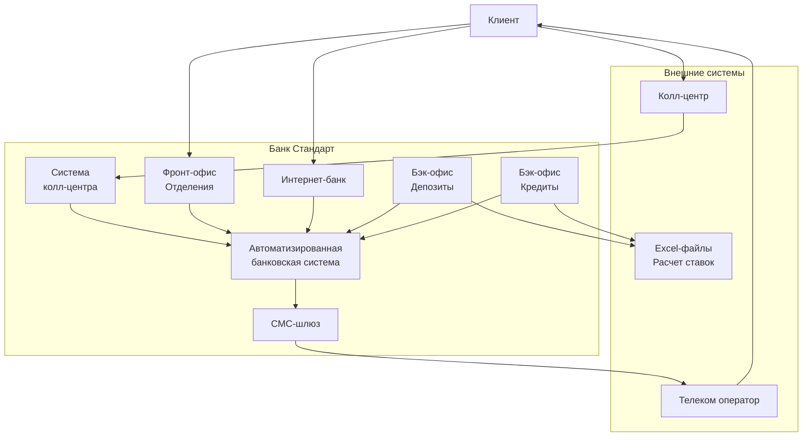

```mermaid
graph TD
    A[Клиент]

    subgraph "Банк Стандарт"
        D[Интернет-банк]
        B[Фронт-офис<br/>Отделения]
        G[Автоматизированная<br/>банковская система]
        I[Бэк-офис<br/>Депозиты]
        M[СМС-шлюз]
        J[Бэк-офис<br/>Кредиты]
        H[Система<br/>колл-центра]
        

    end

    subgraph "Внешние системы"
        F[Колл-центр]
        K[Excel-файлы<br/>Расчет ставок]
        T[Телеком оператор]
    end

    A --> B
    A --> D
    H --> G
    A --> F
    B --> G
    D --> G
    F --> H
    
    I --> G
    J --> G
    
    I --> K
    J --> K
    
    G --> M
    M --> T
    T --> A
```