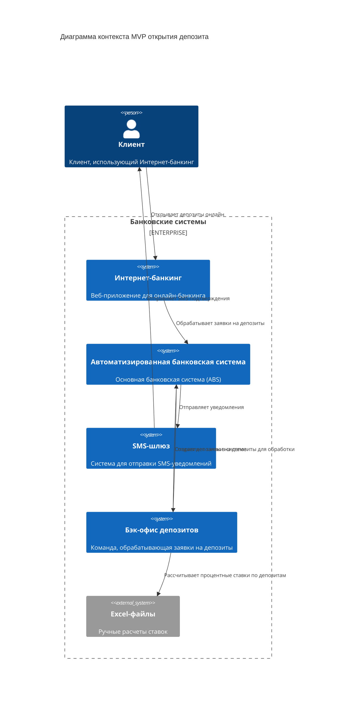
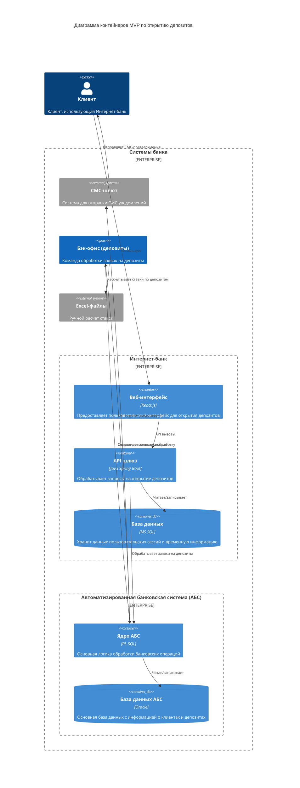

### **Название задачи:**
Открытие депозитов онлайн (MVP)

### **Автор:**
Разработик IT отдела

### **Дата:**
09.09.2025

### **Функциональные требования**

|**№**|**Действующие лица или системы**|**Use Case**|**Описание**|
| :-: | :- | :- | :- |
|1|Клиент, Интернет-банк|Открытие депозита онлайн|Клиент может открыть депозит через интернет-банк, указав счет и сумму|
|2|Клиент, Интернет-банк|Подтверждение операций|Клиент подтверждает операции с помощью СМС-кода в интернет-банке|
|3|Интернет-банк, АБС|Обработка заявок|Интернет-банк отправляет заявки на открытие депозита в АБС для обработки|
|4|АБС, Бэк-офис (депозиты)|Отправка заявок на обработку|АБС отправляет заявки на депозит в бэк-офис для обработки и расчета ставок|
|5|Бэк-офис (депозиты), АБС|Создание депозитов|Бэк-офис создает депозиты в АБС после подтверждения условий|
|6|АБС, СМС-шлюз|Отправка уведомлений|АБС отправляет уведомления через СМС-шлюз клиенту после подтверждения ставки и открытия депозита|
|7|Бэк-офис (депозиты), Excel-файлы|Расчет ставок|Бэк-офис использует Excel-файлы для расчета ставок по депозитам|

### **Нефункциональные требования**

|**№**|**Требование**|
| :-: | :- |
|1|Защита данных при передаче в интернет-банке|
|2|Обеспечение 24/7 доступности сервисов с 99,9% доступностью|
|3|Сохранность персональных данных клиентов|
|4|Обеспечение времени отклика операций в миллисекундах|
|5|Избежание прямой работы интернет-банка с API АБС из-за перегруженности базы данных|
|6|Использование существующих технологий банка (MS SQL, Oracle)|
|7|Мониторинг и логирование компонентов системы|
|8|Хранение ставок по депозитам в XLS-файлах (текущее ограничение)|

### **Решение**

#### Диаграмма контекста

Диаграмма контекста показывает систему открытия депозитов через интернет-банк и его интеграцию с основными банковскими системами. В MVP участвует только интернет-банк как канал взаимодействия с клиентом, который интегрируется с АБС как основной системой хранения данных. Бэк-офис депозитов обрабатывает заявки и использует Excel-файлы для расчета ставок. СМС-шлюз обеспечивает уведомление клиентов.

#### Диаграмма контейнеров

Диаграмма контейнеров детализирует архитектуру интернет-банка и его интеграцию с АБС в рамках MVP. Интернет-банк состоит из веб-интерфейса на React.js, API шлюза на Java Spring Boot и базы данных MS SQL для хранения временной информации. АБС представлена ядром на PL-SQL и базой данных Oracle. Интеграция между системами осуществляется через API вызовы.

#### Обоснование архитектурных решений

При выборе архитектуры MVP были учтены следующие факторы:

1. **Минимальная жизнеспособность**: Архитектура включает только компоненты, необходимые для базового процесса открытия депозитов через интернет-банк.

2. **Интеграция с АБС**: Использован API шлюз для защиты перегруженной базы данных АБС от прямых запросов.

3. **Безопасность**: Реализована защита данных при передаче между интернет-банком и АБС.

4. **Использование текущих процессов**: Сохранена работа с Excel-файлами для расчета ставок, чтобы минимизировать изменения в бизнес-процессах.

### **Альтернативы**

1. **Прямая интеграция с АБС**: Отклонено из-за риска перегрузки базы данных АБС.

2. **Микросервисная архитектура**: Отклонено как избыточная для MVP, увеличивающая сложность.

3. **База данных ставок**: Отклонено из-за необходимости изменений в бизнес-процессах бэк-офиса.

**Недостатки, ограничения, риски**

1. **Ручные процессы**: Зависимость от Excel-файлов для расчета ставок.

2. **Производительность АБС**: Ограничения масштабируемости ядра АБС.

3. **Зависимость от СМС-шлюза**: Риски при недоступности сервиса уведомлений.

4. **Ограниченный функционал**: MVP покрывает только базовый сценарий открытия депозитов.