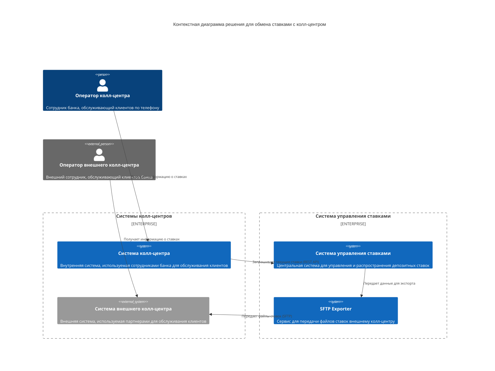
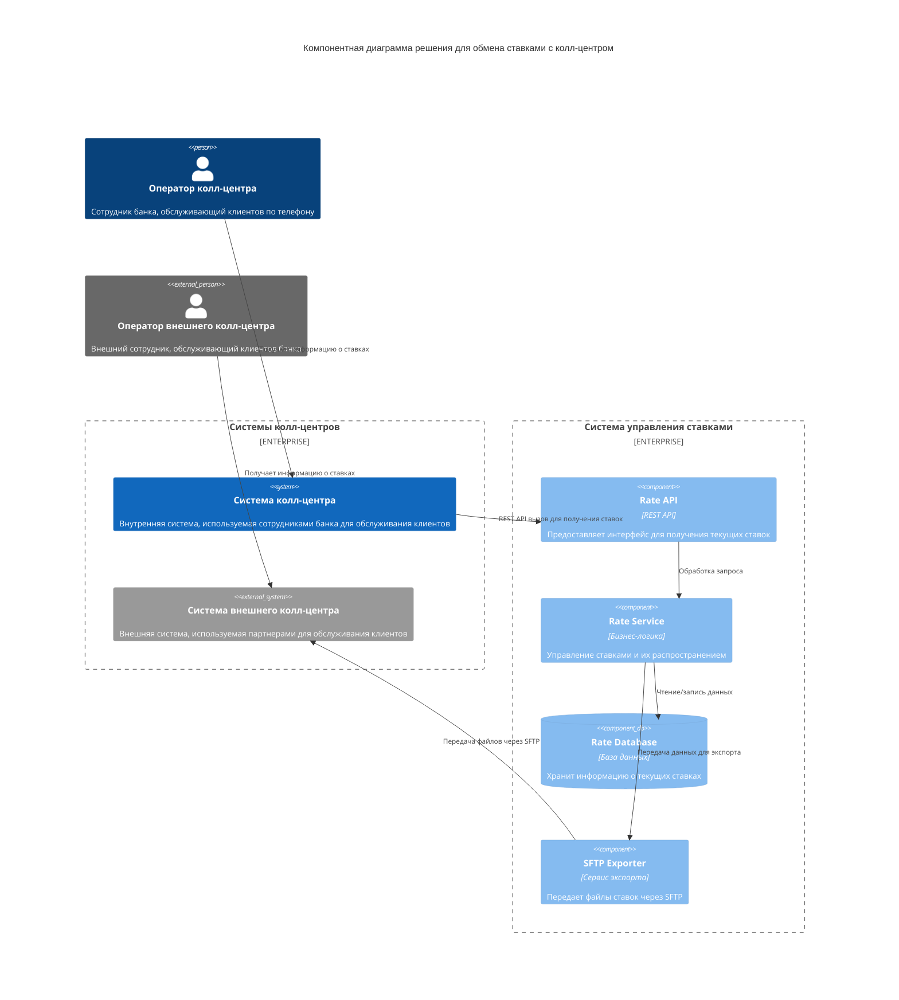

### **Название задачи:** 
Передача ставок в кол-центр

### **Автор:**
Разработик IT отдела

### **Дата:**
09.09.2025

### **Функциональные требования**

|**№**|**Действующие лица или системы**|**Use Case**|**Описание**|
| :-: | :- | :- | :- |
|1|Оператор колл-центра, Система колл-центра|Получение информации о ставках|Оператор колл-центра получает информацию о текущих депозитных ставках через внутреннюю систему колл-центра для консультации клиентов по телефону|
|2|Оператор внешнего колл-центра, Система внешнего колл-центра|Получение информации о ставках|Оператор внешнего колл-центра получает информацию о текущих депозитных ставках через внешнюю систему колл-центра для консультации клиентов банка|
|3|Система колл-центра, Система управления ставками|Запрос текущих ставок|Система внутреннего колл-центра запрашивает текущие депозитные ставки у системы управления ставками через REST API|
|4|Система управления ставками, SFTP Exporter|Экспорт файлов ставок|Система управления ставками передает данные для экспорта в SFTP Exporter для передачи файлов внешнему колл-центру|
|5|SFTP Exporter, Система внешнего колл-центра|Передача файлов ставок|SFTP Exporter передает файлы с актуальными ставками в систему внешнего колл-центра через SFTP-протокол|

### **Нефункциональные требования**

|**№**|**Требование**|
| :-: | :- |
|1|Обеспечение 24/7 доступности сервиса получения ставок с 99,9% доступностью|
|2|Время отклика API для внутреннего колл-центра не более 500 мс|
|3|Защита данных при передаче через API (TLS 1.2+) и SFTP (ключи шифрования)|
|4|Совместимость формата файлов ставок с требованиями внешнего колл-центра (CSV/XML)|
|5|Обеспечение отказоустойчивости системы передачи ставок|
|6|Мониторинг и логирование критичных операций передачи ставок|

### **Решение**

#### Диаграмма контекста

Диаграмма контекста показывает решение для обмена ставками с колл-центром в окружении внешних систем и пользователей. Решение включает как внутренний колл-центр банка, так и внешний партнёрский колл-центр. Основным компонентом является система управления ставками, которая предоставляет интерфейс для получения актуальной информации о депозитных ставках. 

Система взаимодействует с бэк-офисными командами, которые предоставляют базовые данные по ставкам и информацию по кредитным рискам. Для внешнего колл-центра предусмотрена отдельная функциональность передачи файлов через SFTP, так как у внешней системы нет возможности делать API-вызовы.

#### Диаграмма компонентов

Диаграмма компонентов детализирует архитектуру системы управления ставками и её взаимодействие с другими системами. Система состоит из нескольких ключевых компонентов:

1. **Rate API** - REST API интерфейс для получения текущих ставок внутренним колл-центром
2. **Rate Service** - бизнес-логика управления ставками на Java Spring Boot
3. **Rate Repository** - уровень доступа к данным ставок
4. **Rate Database** - база данных PostgreSQL для хранения информации о ставках
5. **SFTP Exporter** - сервис для экспорта файлов ставок через SFTP для внешнего колл-центра

Компоненты взаимодействуют между собой через чётко определённые интерфейсы. Rate API предоставляет данные внутренним системам через REST вызовы, в то время как внешнему колл-центру данные передаются в виде файлов через SFTP.

#### Обоснование архитектурных решений

При выборе архитектуры были учтены следующие факторы:

1. **Поддержка разных типов колл-центров**: Решение поддерживает как внутренний колл-центр банка (через API), так и внешний партнёрский колл-центр (через файлы), что соответствует бизнес-требованиям.

2. **Существующая технологическая база**: Использованы уже имеющиеся технологии (Java Spring Boot, PostgreSQL), что снижает риски и затраты на внедрение.

3. **Производительность**: Предусмотрено горизонтальное масштабирование компонентов системы управления ставками для обеспечения высокой доступности и быстрого времени отклика.

4. **Безопасность**: Реализована защита данных при передаче (TLS для API и SFTP с ключами шифрования для файлов), а также сохранность персональных данных клиентов.

5. **Интеграция с существующими системами**: Решение интегрируется с существующими системами без необходимости их модификации, что снижает риски и затраты на внедрение.

### **Альтернативы**

1. **Единый подход для всех колл-центров**: Вместо использования разных механизмов (API для внутреннего и файлы для внешнего колл-центра) можно было бы использовать только API. Однако это невозможно из-за технических ограничений внешнего колл-центра.

2. **Прямая интеграция с АБС**: Вместо создания отдельной системы управления ставками можно было бы интегрироваться напрямую с основной банковской системой. Однако это увеличило бы нагрузку на критичную систему и не обеспечило бы необходимой гибкости.

**Недостатки, ограничения, риски**

1. **Зависимость от внешнего колл-центра**: Передача файлов через SFTP создаёт зависимость от внешней системы и возможные задержки в обновлении информации о ставках у внешнего колл-центра.

2. **Сложность синхронизации данных**: Использование разных механизмов передачи данных (API и файлы) усложняет синхронизацию и контроль актуальности информации у разных колл-центров.

3. **Безопасность передачи**: SFTP передача требует дополнительных мер по управлению ключами шифрования и мониторингу.

4. **Масштабируемость**: При росте нагрузки система управления ставками может стать узким местом, несмотря на возможность масштабирования.

5. **Форматы файлов**: Поддержка требуемых форматов (CSV/XML) для внешнего колл-центра может потребовать изменений при обновлении требований.